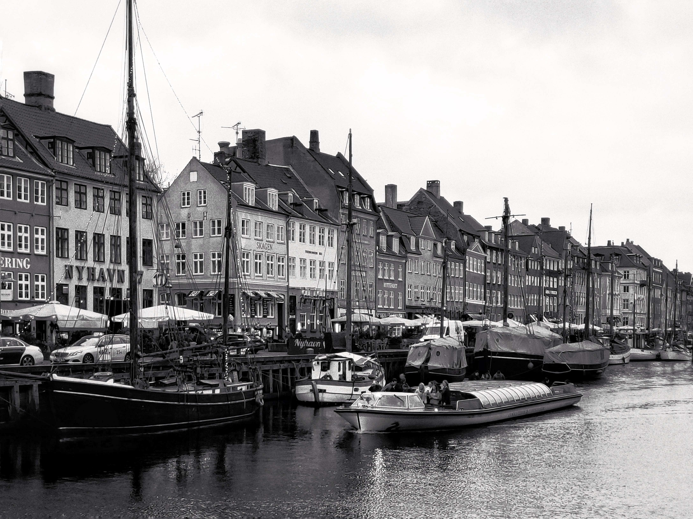

<!--  -->

8 PM and I was wandering around the main street of the city. The sky of that night was flat black and the darkness was cut only by the yellowish lights of the street lamps scattered here and there along the street. I was a man from the north, transplanted even further north, in a foreign country, with its rhythms and traditions. The shop shutters were already all down, there were few people around and everything appeared neatly calm.
 
 
One of the things I've learned while wandering around the world is that the main street is often boring, a copy and paste repeated throughout the whole world. If you really want to discover the soul of a city you have to walk, if you want to undress a woman you have to talk, if you want to see the truth you have to get drunk. So I walked and, slowly, I left the main street behind until I reached a small neighborhood. Red brick buildings interspersed with large black asphalt streets, a church around the corner, the metro stop in the middle of the square and a small bar hidden under the balconies of one of the many buildings with a red brick facade facing a street of black asphalt.
 
 
It was eight in the evening and after all that walking I was thirsty, so I decided to go into that little bar. The walls were white, the space narrow and intimate, there were no more than ten people. The light wood tables, in contrast with the dark wood floor, the stools topped by soft cushions of different colors and the counter in the center of the room. The entrance door was left ajar, otherwise the large windows on both sides would mist up.
 
 
I sat down in the corner and had a stout. I stood there a while to observe. There was no great sociability and silence filled the void. Many were sitting alone, like me, and the groups of people did not exceed three components. However, there was a great humanity, a sort of respect for others and their spaces, a feeling that warmed you almost like a hug. Or maybe it was the beer.
 
 
I was lost in thoughts and sips of beer that I almost frightened when I saw that a girl was sitting in front of me. Blue eyes, pastel pink skin, the hair, gathered in a ponytail, of a clean and blinding blond, dazzling smile. Hands had tapered fingers, but the nails had no polish of any kind or color. She wore a red turtleneck sweater, with a few white lines here and there. A neck not too high to hide a mark on her neck, a scar or a joke of the light and its reflections. It felt like perfection, dusty to be felt real.
 
 
Fourth stout but she still hadn't stopped asking me questions. Questions about everything, she seemed to be discovering the world for the first time. The door of the room was still closed but the walls seemed fogged up, I wasn't so sure what was happening anymore. At that moment the girl took my hand and dragged me out of the room. She asked me to take her home. On the street, everyone looked at her. They stared at her. They craved her. She quickened her pace, I followed her from a little further back. I looked like one of them, just a little luckier.
 
 
Her house didn't turn out very far, a little more than a mile. Arriving at the door, she hastily greeted me, thanked me under his breath, and ran up the stairs. Her body remained sinuous even in those frantic movements. I stood still for a moment, enchanted and amazed by everything that had just happened. Then the door opened again and another girl came out. Burnt brown hair, ruffled by humidity, dark and flat eyes, irregular features and a t-shirt a few sizes larger. He had a garbage bag in her hand.
 
 
When she saw me she stopped in front of me, she was a few centimeters from me but I couldn't read her dark eyes, she seemed shielded by a strength of mind that perhaps I didn't have the courage to face. I felt closely observed, read like an open book. He thanked me for taking his sister home. Even today I wonder how he understood it.
 
 
She told me how worried she was for her sister. Her sister's beauty is the product of a society that wanted her to be this way and built a story around it that does not belong to her. She told me about when they kidnapped her sister, when they tried to slit her throat and when they used her for racist propaganda. Her sister is no longer a woman or a human being, she is now a faded image that counts as much as a number. A place to be visited, photographed and forgotten.
 
 
She, the girl with the garbage in hand, claimed to be luckier. She was the product of intentions and actions. She was a woman who required patience and attention. She had been endowed with a heavy and cumbersome soul, unlike her sister, her burden was not immediately visible, for this reason she was spared from the envy of a world that stops to read only the cover. She was a diamond enclosed within a black pearl. All possible colors of the color spectrum shielded by a color that a color is not. Eventually I had the courage to look into his eyes. Or it was the beer.
 
 
He threw away the garbage bag with a precise and calculated gesture, turned around and thanked me again. She smiled, opened the door with her right hand and her head down, turned, moving calmly, as if in slow motion, looked at me. Her eyes were less dark. She looked down, smiling slightly, then closed the door. I stood there for a couple of minutes, but the door never opened again.
 
 
I started walking again. Passing through streets covered with buildings, bridges and large avenues, I found myself at the entrance to what looked like a park, or at least a large green area. From the outside, faint music could be heard, stunning smells, of those that give to the head, and, among the foliage of the trees, lights shone intermittently as if they were fireflies.
 
 
A street art exhibition was in progress in the main square. There was everything: rusty wire woven with bicycles, murals on skater walls, paintings joined by Nepalese flags and even wooden giants. I find street art to be very expressive and a great communication vehicle. While I was intent on observing with great interest the wooden giant with a sapling in his hand, a woman approached me.
 
 
Medium height, jet-black hair with a few shades of over-saturated green, eyes of a deep, abysmal blue, and a small piercing on the side of the nose that shone like a star. Her name was Cristina and those were her works. SHe told me how few are those who observe his works so scrupulously, that there are many who even try to suppress and boycott his exhibitions and that his warehouse was burned more than once. But she was still there. Proud of her expressiveness, strong in her ideals. A free woman has no boundaries except those of respect.
 
 
Cristina has another peculiarity: she does not allow you to take pictures of her works. Not out of jealousy, not out of delusions of grandeur. SHe wants his works to be lived, to be told, he wants her works to leave memories to be handed down, moments and sensations to be told. Like this night, this night has left me many things to tell.
 

