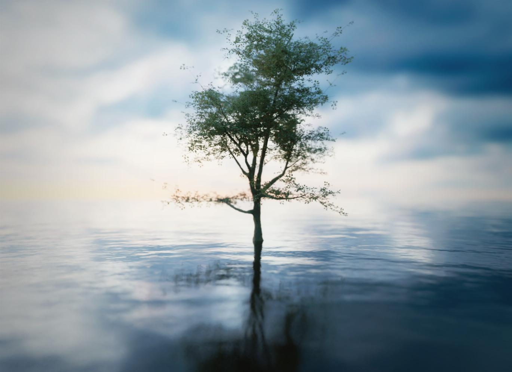
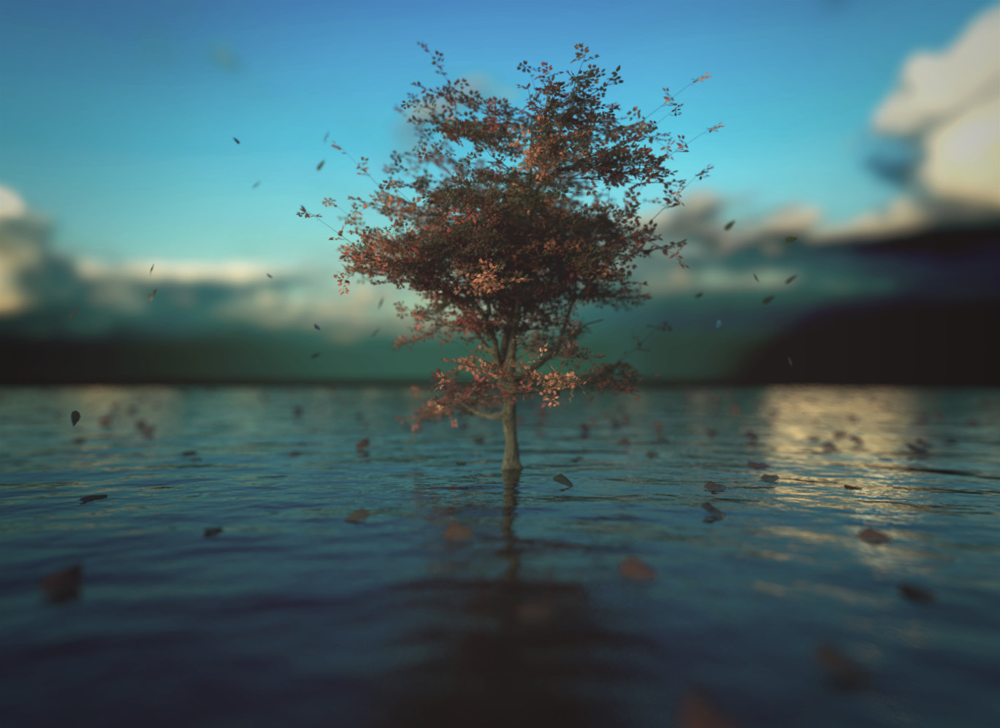
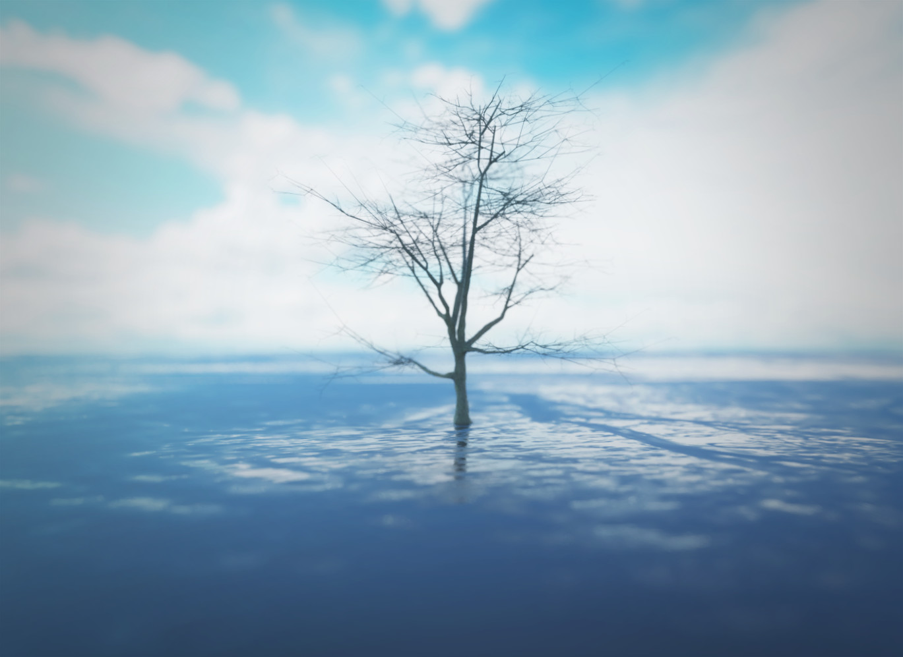

At the beginning, everything is nothing.
 
Everything gets built by itself,
 
above its roots,
 
which grow and spread even in hostile land,
 
in lands where nothing has managed to grow before now.
 
 
<!--  -->
 
 
It’s an eternal process,
 
a process that happens faster than a flash of lightning.
 
It’s something you stand by,
 
terribly hoping to be part of that process,
 
but you’re so focused on who knows what you do not realize it’s already happening.
 
 
Once it has happened,
  a strong feeling,
 
a feeling that gives you warmth,
 
holds you in a hug that gifts you peace and relaxation.
In that moment everything is brighter than usual,
 
everything is warmer than usual,
 
everything is more florid than usual.
 
 
<!--  -->
 
 
But then it burns.
 
It slowly burns,
 
changes his skin,
 
what seems to be his weakness is actually his strength,
 
it spreads his knowledge so that everyone can feed on it.
 
A generosity that seems to end everything but it is just a new beginning.
 
 
<!--  -->

