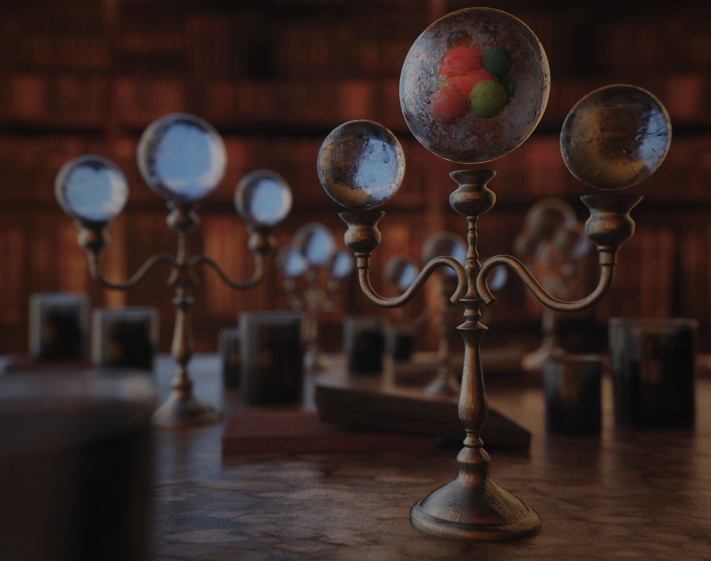

<!--  -->

There is one frightened,
 
who speaks softly under his breath.
 
There is one forgotten that,
 
banging on every wall, wandering,
 
tries to get back on the right path.
 
There is one strong who,
 
screaming in the face of others
 
tries to drive them away,
 
so as to remain alone in the whole territory,
 
conquering nothingness.
 
There is a small one that shines
 
like the full moon on a clear summer night
 
and there is one big, cumbersome, colorless,
 
still, it seems almost fake, useless.
 

There is one for each person,
 
substance,
 
for every color,
 
for every smell,
 
for every shape and size,
 
for every thing seen,
 
for everything not seen
 
and also for those that do not yet exist.
 
There is one for each of us,
 
irreplicable, unique in its moment,
 
characteristic for form color, sensation, memory.
 
Whether you remember or not, they will always be there,
 
firm, unforgettable, locked up
 
in a sphere of frozen glass.
 

