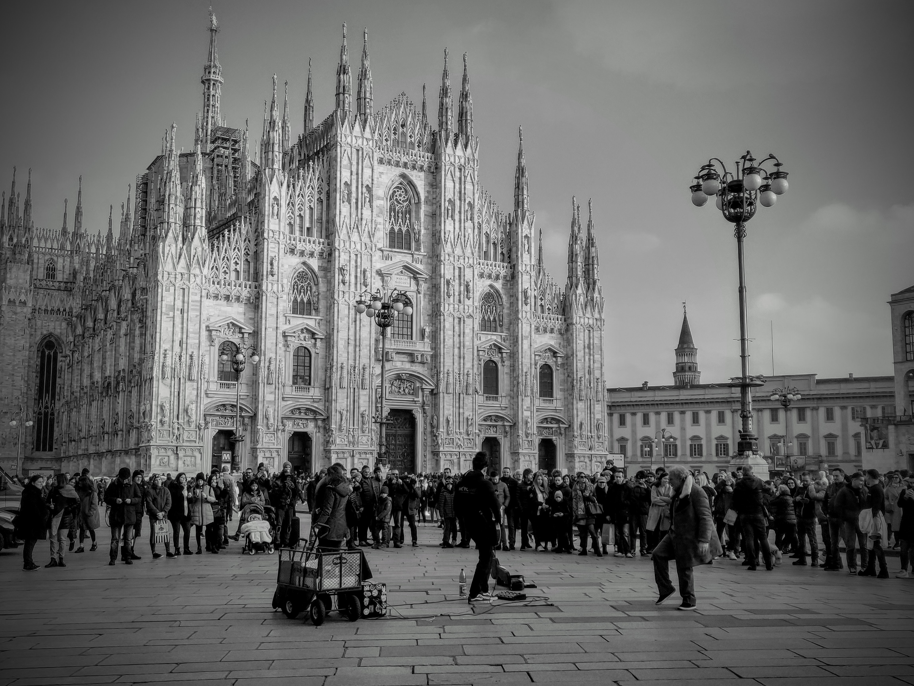

Immagina di star camminando, lungo la via principale della tua città. In mezzo alla folla, con le carezza dei suoni aggrovigliati delle persone schermati dalle cuffie, che suonano a ritmo del tuo umore.
 
 
Il sole sta tramontando e ammorbidisce le rughe dei palazzi che abbracciano i lati della via. Le luci dei negozi, nascoste dai portici, addobbano la strada come un albero di natale e la riempiono di odori e profumi, come non bastasse quello della donna che ti ha appena sfiorato, senza nemmeno accorgersi, aiutata dagli occhiali neri e dal passo spedito.L’ufficio è alle spalle, la giornata è finita. Gli amici sono al bar, la serata comincia.Chiudi gli occhi.Immagina di esser fermo, immobile. Abbracciato da un freddo silenzio, una luce intermittente che proietta ombre incerte sulle pareti. Ormai è notte e non c’è più nessuna serata.
 
  
Sei nella tua camera da letto, avvolto da quell’aria di casa tanto familiare ma ormai troppo usata per essere respirabile. Ti alzi, con le gambe intorpidite dal poco movimento, ti trascini ciondolante alle finestra, scosti la tendi e osservi la vuotezza di cui è piena la strada. Il giorno del giudizio, e qualcuno ha deciso di risparmiarmi per punirmi, pensi. E subito dopo passa un militare, armato non di fucile e non di megafono, intima di stare a casa: c’è un nemico che non si può sconfiggere col piombo.Chiudi gli occhi.Immagina di correre.
 
  
Scalzo, lungo la riva del mare, attraverso il rosa di una tenera alba. L’odore della salsedine che si mischia al tuo sudore, la gola secca e i polmoni che si stringono, la fatica che la fa da padrone ma perde dala gioia di essere liberi e non avere un orizzonte che ti limita. Sogna di poter arrivare dove vuoi, verso l’infinito ed oltre. Poi però ti fermi, le mani si appoggiano sulle ginocchia e la schiena si curva mentre il respiro diventa sempre più affannoso.
 
 
 

 
 
  
Una goccia di sudore scende dalla fronte, attraverso l’occhio chiuso si fa strada, e dalla punta del naso, cade per terra.Chiudi gli occhi.Immagina di essere seduto. La sedia della tua scrivania è diventata come il trono di un re, da cui vedere e sentire tutto ciò che c’è da sentire a proposito del mondo. I giorni sembrano ripetersi, uno simile all’altro, la notte che si mischia col giorno. 
 
 
Hai sempre voluto più tempo da dedicare a te stesso, eppure di perdi in quello strano e bizzarro mischiarsi di stelle e nuvole. Hai sempre voluto un po di silenzio per poterti ascoltare, lontano dal solito rumore della routine, ma hai paura di ascoltare l’eco del silenzio che ti circonda. Eppure non aver paura, ascoltati, ora che nessuno può vederti, non devi nascondere il tuo cuore dietro il camino. Chiudi gli occhi.
 
 
Immagina di star camminando, lungo la via principale della tua città. In mezzo alla folla, con le carezza dei suoni aggrovigliati delle persone schermati dalle cuffie, che suonano a ritmo del tuo umore. Apri la porta del bar, i tuoi amici sono lì.Chiudi gli occhi.
 
 
I sogni, e gli incubi, i più belli, e i più brutti, tutti, finiscono. E se ci sforziamo di ricordare, potremmo imparare molto. Perché avere una cattiva memoria aiuta ad essere felici ma la vera felicità implica anche impegno e dolore. Ed saremo felici, insieme.Ma non ora, ora chiudi gli occhi, e sogna.
