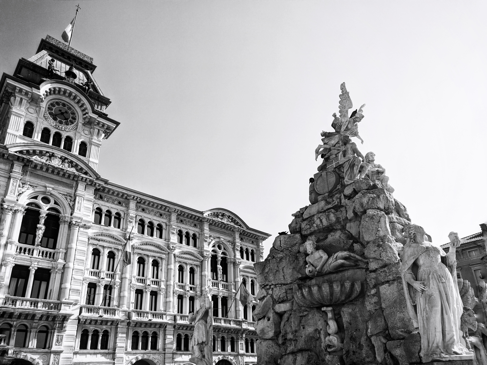

Alone e lonely She stands.
 
 
Like those who walk with their eyes pointing to the sky, to avoid any peek or glance,
 
but still they observe.
 
Like those who sip an amber drink at the bar when outside it’s cold and it’s raining.
 
 
She has been with everyone but never she gave herself to anyone, conquered and never seduced.
 
In her everyone found refuge, only by her hand.
 
In her someone found death, never by her hand.
 
 
Tall and naked, audacious, She stands before you, proud as a warrior.
 
She shows wrinkles and wounds, because She does not deny the kiss of the sun.
 
Jealous of herself, She found her damnation starving for harmony.
 
 
Raw and bloody, on the road left and often ignored.
 
Regal and glaring, taken by her hand and admired.
 
She was the cause of educated men,
 
of barbarian men she has suffered the effects.
 
 
Among men and years, she stood still, utopic constant.
 
She learned to remember and therefore tell with her mouth shout,
 
to guide you with her grey eyes and light you up with a smile,
 
when it's dark and you let yourself be cherished by her curves,
 
in an embrace that absorbs the calm and melancholy waters that wet you,
 
of the sadness that characterizes and enhances her.
 
 
You don't go for her, you surrender to her,
 
charmed, fascinated and warmed by her pearled skin,
 
dominated and crushed by a weight that no one can bear,
 
only her, only her,
 
here is why, when She decides it's your time, you look at her one last time.
 
 

 
 
A short story about Trieste.
 
 
A city that I have long wanted to visit and, like the best of things, it happened by chance, by pure coincidence.
  
  
In Trieste you can find a rare landscape. The city is bathed by the Adriatic Sea and protected by the Alps, on the border with Croatia and overlooking Albania.
 
  
 A strong and audacious city, like the pier, Molo Audace, that characterizes it. Rich in history, including recent ones, like the Risiera di San Sabba, a nazi concentration camp in Italy and a place of great memory. 
   
   
 Trieste was once a roman city, in the center there is a Roman amphitheater and an old gate, once the entrance to the city, at the time Trieste was called Tegeste. 
   
 Synagogues flanked by churches, Trieste is union and mix of cultures, all based on respect. If you seek inspiration or refuge, in Trieste you will find them.
   
   
In the photo, you can see the main square, Piazza Unità, and The Fountain of Four Continents. The photo is in black and white, so that you can paint it with colors, these two lines have aroused you.
