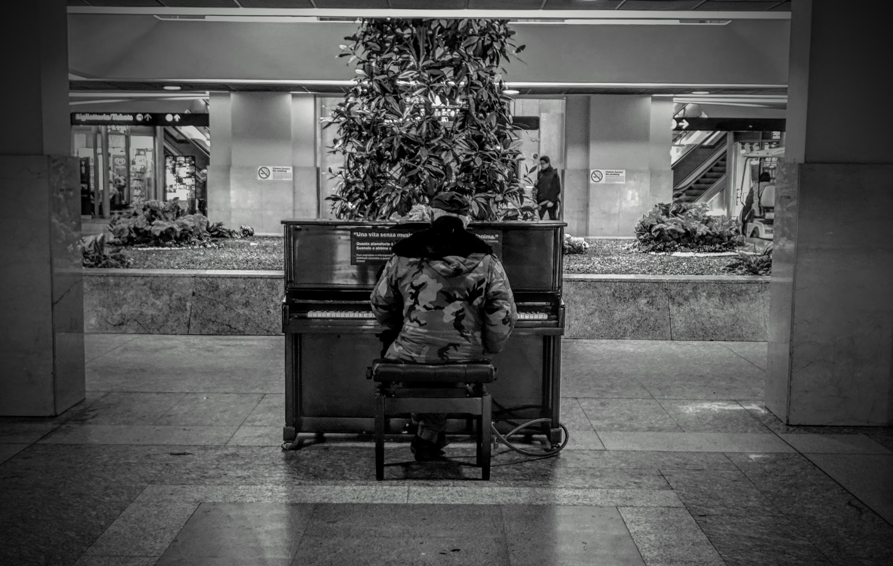

<!--  -->

I expected a cold city.
 
I expected an austere city.
 
I expected a city, still in its desired nobility.
 
I expected a city that screams speeches without arguments.
 
I expected a city that would look at you with a eye of superiority, from top to bottom, almost snubbing you.
 
I expected a detached city, almost annoyed to have you there, on its streets.
 
I expected a city that would make you walk on its way but didn’t want to get dirty.
 
 
From the very first step, however, I realized that I was wrong.
 
Turin is a city that welcomes you without saying anything, which allows you to walk on its large, huge, shiny streets.
 
Turin will always follow you, on those street, a step back to protect yourself and step forward to see you smile, while admiring its beauty.
 
 
Turin is an open city, she lets you breathe, she allows you to look up at the sky, with a nose in the air, stunned by the blue, and freezed by its harming cold.
 
Because Turin is not cold, Turin is cold that warms your heart.
 
Turin does not tell you anything, but Turin wants you to tell it something, because it likes to listen.
 
Turin is a soul that suffers, contradictory, in constant change.
 
Turin is an agitated city but perfectly in controll of her movement.
 
Turin is a calm sea that thrives on storms.
 
Turin is appearance that hides essence.
 
Turin is everything and nothing and everything or nothing.
 
 
Turin is that old noble lady, with an exaggeratedly expensive and too big and obvious fur coat, a scarlet red lipstick and a skin hollowed out by wrinkles but characterized by a young complexion, a mixture of pale cream and pale pink.
 
 
Turin is just that lady there, the one who passes by you sideways, pedantic and superior, walking on low heels whose sound vibrates in the air, until it reaches your ears and make you perceive his gait, determined but marked, which seems to slow down in your presence, as if to watch you.
 
 
Turin is just that lady there, who, just when she passes you by, crosses your eyes with her icy, glassy eyes of emotion, but that smiles at you, just before turning the corner and disappearing.
 
Turin is a city that does not ask you for anything and does not want anything, but the sound of those heels echoes in your soul as well as the desire to meet that glance persists, at least another time.
